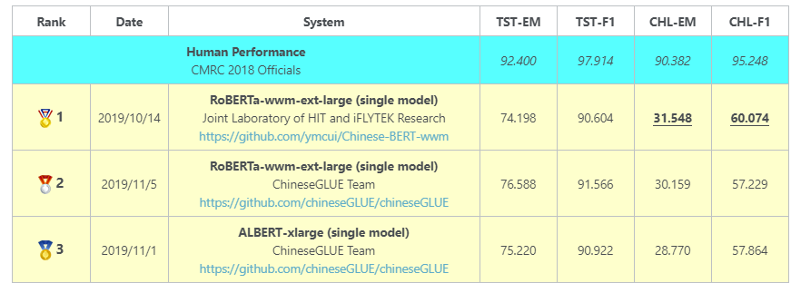
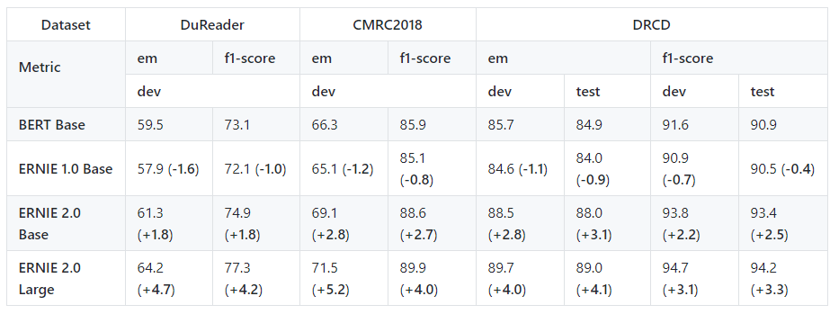

# 阅读理解

- 官方网站： <https://hfl-rc.github.io/cmrc2018/open_challenge/>
- 语料github网站：<https://github.com/ymcui/cmrc2018>
- 语料链接：<https://worksheets.codalab.org/worksheets/0x92a80d2fab4b4f79a2b4064f7ddca9ce/>

## 数据介绍

- 数据量：训练集(短文数2,403，问题数10,142)，试验集(短文数256，问题数1,002)，开发集(短文数848，问题数3,219)。例子：

~~~shell
{ "version": "1.0", "data": [ { "title": "傻钱策略", "context_id": "TRIAL_0", "context_text": "工商协进会报告，12月消费者信心上升到78.1，明显高于11月的72。另据《华尔街日报》报道，2013年是1995年以来美国股市表现最好的一年。这一年里，投资美国股市的明智做法是追着“傻钱”跑。所谓的“傻钱”策略，其实就是买入并持有美国股票这样的普通组合。这个策略要比对冲基金和其它专业投资者使用的更为复杂的投资方法效果好得多。", "qas":[ { "query_id": "TRIAL_0_QUERY_0", "query_text": "什么是傻钱策略？", "answers": [ "所谓的“傻钱”策略，其实就是买入并持有美国股票这样的普通组合", "其实就是买入并持有美国股票这样的普通组合", "买入并持有美国股票这样的普通组合" ] }, { "query_id": "TRIAL_0_QUERY_1", "query_text": "12月的消费者信心指数是多少？", "answers": [ "78.1", "78.1", "78.1" ] }, { "query_id": "TRIAL_0_QUERY_2", "query_text": "消费者信心指数由什么机构发布？", "answers": [ "工商协进会", "工商协进会", "工商协进会" ] } ] } ] }
~~~

## 任务介绍

- 第二届“讯飞杯”中文机器阅读理解评测 (CMRC 2018)
- 今年我们将聚焦**基于篇章片段抽取的阅读理解（Span-Extraction Machine Reading Comprehension）**，作为填空型阅读理解任务的进一步延伸。虽然在英文阅读理解研究上有例如斯坦福SQuAD、NewsQA等篇章片段抽取型阅读理解数据集，但目前相关中文资源仍然处于空白状态。本届中文机器阅读理解评测将开放**首个人工标注的中文篇章片段抽取型阅读理解数据集**，参赛选手需要对篇章、问题进行建模，并从篇章中抽取出连续片段作为答案。 **本次评测依然采取训练集、开发集公开，测试集隐藏的形式以保证评测的公平性。**

## 榜单说明

### 官方榜单

- `TST`: Test set, `CHL`: Challenge set
- The ranking are obtained by the average score of `TST-EM`, `TST-F1`, `CHL-EM` and `CHL-F1`.

### 百度榜单

- 网站：<https://github.com/PaddlePaddle/ERNIE>

### CLUE榜单

- CLUE榜单： <https://www.cluebenchmarks.com/rc.html>
- 