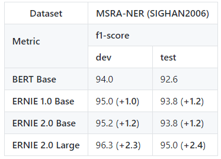

# 命名实体识别

- MSRA-NER (SIGHAN2006) 数据集由微软亚研院发布，其目标是识别文本中具有特定意义的实体，包括人名、地名、机构名。
- MSRA-NER (SIGHAN2006) dataset is released by MSRA for recognizing the names of people, locations and organizations in text.
- http://sighan.cs.uchicago.edu/bakeoff2006/

## 榜单

### 百度评测结果

- 参考网站：https://github.com/PaddlePaddle/ERNIE

