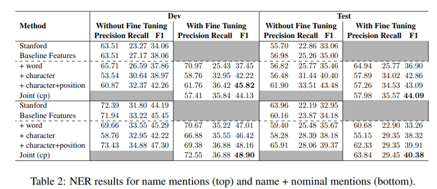
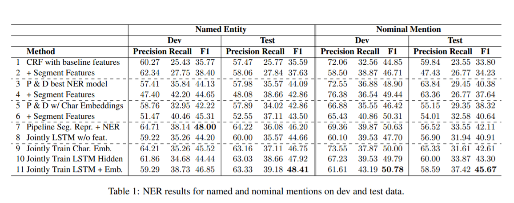

# 模型训练结果

## 原始数据训练结果

- `random`采用100维随机初始化的词嵌入；
- `word2vec`采用`cn_char_fastnlp_100d`；
- 训练结果

| 词嵌入           | 模型       | 测试集表现（span F值；3次测试） | 平均F值 |
| ---------------- | ---------- | ------------------------------- | ------- |
| random           | bilstm-crf | 0.386399；0.41954；0.394118     |         |
| word2vec         | bilstm-crf | 0.440233；0.405844；0.436533    |         |
| bert(不更新参数) | bilstm-crf | 0.686224；0.640523；0.647292    |         |
| bert(更新参数)   | bert-crf   | 0.691076；0.669031；0.681657    |         |

- 模型大小

| 词嵌入           | 模型       | 模型大小（MB；3次测试） | 平均大小（MB） |
| ---------------- | ---------- | ----------------------- | -------------- |
| random           | bilstm-crf | 3；3；3                 | 3              |
| word2vec         | bilstm-crf | 3；3；3                 | 3              |
| bert(不更新参数) | bilstm-crf | 345；345；345           | 345            |
| bert(更新参数)   | bert-crf   | 339；339；339           | 339            |

## 训练数据使用最优模型预测后的数据

- 训练结果

| 词嵌入           | 模型       | 测试集表现（span F值；3次测试） | 平均F值 |
| ---------------- | ---------- | ------------------------------- | ------- |
| random           | bilstm-crf |                                 |         |
| word2vec         | bilstm-crf | 0.459701；0.458824；            |         |
| bert(不更新参数) | bilstm-crf |                                 |         |

- 模型大小

| 词嵌入           | 模型       | 模型大小（MB；3次测试） | 平均大小（MB） |
| ---------------- | ---------- | ----------------------- | -------------- |
| random           | bilstm-crf | 3；3；3                 | 3              |
| word2vec         | bilstm-crf | 0.459701；0.458824；    |                |
| bert(不更新参数) | bilstm-crf |                         |                |

## 论文内实验结果

- Peng N, Dredze M. Named entity recognition for chinese social media with jointly trained embeddings[C]//Proceedings of the 2015 Conference on Empirical Methods in Natural Language Processing. 2015: 548-554.

- Peng N, Dredze M. Improving named entity recognition for chinese social media with word segmentation representation learning[J]. arXiv preprint arXiv:1603.00786, 2016.

